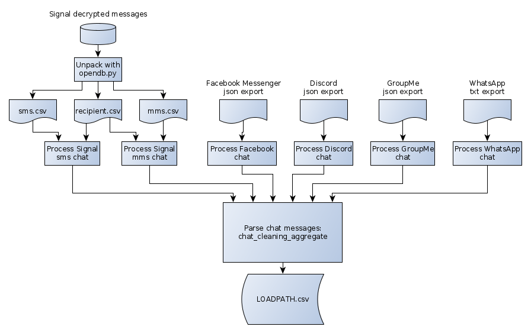

.. POTATo: Pandas Online Text Analysis Tool documentation master file, created by
   sphinx-quickstart on Tue Jun 16 21:04:08 2020.
   You can adapt this file completely to your liking, but it should at least
   contain the root `toctree` directive.

Welcome to POTATo: Pandas Online Text Analysis Tool's documentation!
====================================================================

.. toctree::
   :maxdepth: 4
   :hidden:
   :caption: Contents:

   source/exporting_chats
   source/chat_format
   source/config_file

Introduction
============

This collection of Python visualizations and analyses of chat messaging
histories was born out of our desire to see the evolution of our relationships
through our messages. The visualizations currently provided are a small sample
of what could be done with the collected data and the conversation metrics
we examine, but we judged these to be the most interesting plots for now.

User Guide
==========
1. Export all relevant chats across all relevant platforms: we currently
   support Signal, Discord, Facebook Messenger, WhatsApp, and GroupMe. Follow
   the relevant procedures to get them into the correct format, thus getting to
   the starting points of the flowchart below.
2. Create a config file - specify the locations of the chat exports, potential
   pseudonyms, colors for graphing, etc.
3. In the case of Signal chats, use chat_cleaning/opendb.py to extract tables
   from the exported database.
4. Parse the raw chats into an aggregated CSV file: run chat_cleaning_aggregate
   to produce an aggregate cleaned csv file containing the entire chat history
   with the sender(s).
5. Make plots as desired by running the plot-making files.

   
   Flowchart of chat parsing operations from raw data export to final cleaned csv file.

Plots
=====

* make_bin_plots generates what we called "binned" plots: the chat messaging
  history is sliced into time intervals (for example, days), and a data point
  is taken for each slice (for example, number of words written in the day).
  This is then plotted in an area graph.

* make_aggregate_plots generates plots using the text messaging history as a
  whole, ignoring time evolution. This consists of broad word/text per person
  bar graphs, a scatterplot of the number of words per conversation, and a
  scatterplot of the number of words vs duration of conversation. 

* make_heatmap_plots generates heatmaps with hours on x-axis and days on y-axis
  (though this can be changed to an arbitrary size matrix).

* make_word_ratio_scatterplots generates a scatterplot with each point
  representing a word, its position on the x-axis representing the ratio of its
  use between two senders, and its position on the y-axis representing how many
  times it occurs in the messaging history. This is the only plot that does not
  work for more than two senders.

Dependencies
============

This toolkit was developed for Python 3.7 or later. Additionally, the following
packages are needed:

* pandas
* numpy
* pyyaml
* plotly
* emoji
* nltk
* rake_nltk
* pathlib (for parsing Facebook Messenger messages)
* sqlite3 (for extracting Signal messenger backup)

.. toctree::
   :maxdepth: 4
   :caption: Modules:

   source/config
   source/chat_cleaning
   source/chat_cleaning_aggregate
   source/text_summary
   source/text_summary_list_utils
   source/file_utils
   source/stat_utils
   source/string_utils
   source/make_aggregate_plots
   source/make_bin_plots
   source/make_heatmap_plots
   source/make_word_ratio_scatterplot

Indices and tables
==================

* :ref:`genindex`
* :ref:`modindex`
* :ref:`search`
